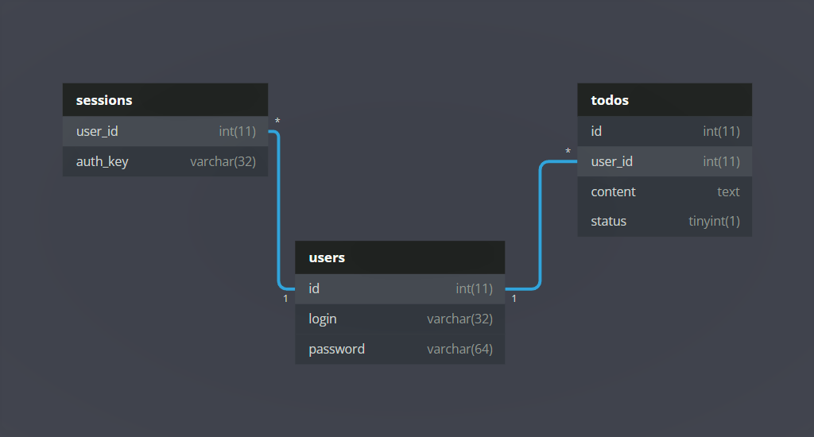

# Java Todo App Server
> Node.js server for todo app created in JavaFX

## General Information

## Technologies Used
- Node.js - 17.4.0
- Express - 4.17.2
- body-parser - 1.19.1
- mysql2 - 2.3.3

## Database

 *Database schema*
<br />
<br />
<br />

SQL code to create a MySql database structure:

```mysql
-- Databse name: todo_app_db

CREATE TABLE `sessions` (
  `user_id` int(11) NOT NULL,
  `auth_key` varchar(32) NOT NULL
) ENGINE=InnoDB DEFAULT CHARSET=utf8mb4;


CREATE TABLE `todos` (
  `id` int(11) NOT NULL,
  `user_id` int(11) NOT NULL,
  `content` text NOT NULL,
  `status` tinyint(1) NOT NULL
) ENGINE=InnoDB DEFAULT CHARSET=utf8mb4;


CREATE TABLE `users` (
  `id` int(11) NOT NULL,
  `login` varchar(32) NOT NULL,
  `password` varchar(64) NOT NULL
) ENGINE=InnoDB DEFAULT CHARSET=utf8mb4;


ALTER TABLE `sessions`
  ADD UNIQUE KEY `AuthKey_Unique` (`auth_key`);

ALTER TABLE `todos`
  ADD PRIMARY KEY (`id`);

ALTER TABLE `users`
  ADD PRIMARY KEY (`id`);

ALTER TABLE `todos`
  MODIFY `id` int(11) NOT NULL AUTO_INCREMENT, AUTO_INCREMENT=52;

ALTER TABLE `users`
  MODIFY `id` int(11) NOT NULL AUTO_INCREMENT, AUTO_INCREMENT=4;
COMMIT;


```

